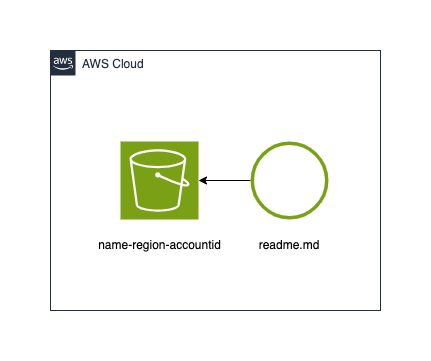

[](https://constructs.dev/packages/hello-construct-hub)

<a href="https://www.buymeacoffee.com/talkncloud" target="_blank"></a>

# What is this?

This is a basic hello world style example to demonstrate how to publish constructs to [construct hub](https://constructs.dev/). There are more details in the blog write up if interested: [wtf is construct hub](https://www.talkncloud.com/wtf-is-construct-hub/)

It will do the following:

1. Create an s3 bucket with a standard naming scheme.
2. Upload docs (a readme) into the bucket using a bucket deployment.



If you copy how this project works it will publish to construct hub.

## How this was created

This project uses projen and was initialized like so:

```shell
npx projen add awscdk-construct
```

### You will need to

1. Update your pipeline with a valid NPM_TOKEN to publish packages
2. Update your pipeline with a valid github token named PROJEN_GITHUB_TOKEN for self mutation changes (optional)]

### Building and testing

Because this uses projen this should be pretty straight forward:

1. yarn projen build

This will do all of the package building, jsii work, testing and snapshot updates, doc updates etc.

From here you should be able to do things like `npm link` the package to a local project for testing or update the package.json with the path to the package.
